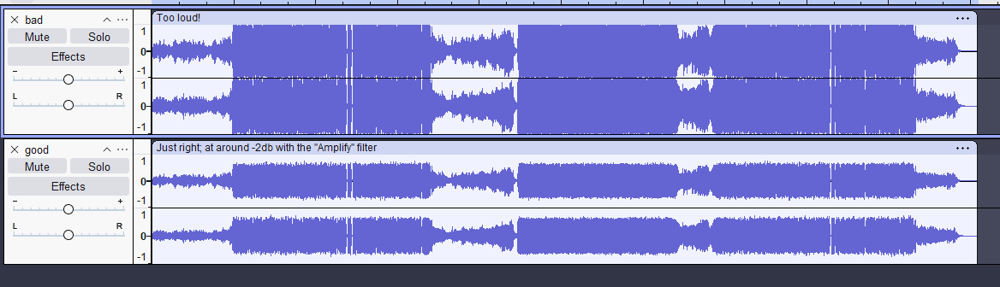

# How to contribute

last updated 4/14/2026

_The Impossible Game 2+_ is a mod of The Impossible Game 2.

# Asking for Custom Songs

### PLEASE READ before creating a new song issue!

There are a few rules to follow when creating a new issue asking the developers to add a new song:

- Supply two audio files; preferably .mp3 ones, one for the main song, and then a snippet of the song.
- The audio file name format is traditionally "artist-song-name.mp3"
- The snippet must be around 9 seconds long and has a 2 second fade-in and fade-out. Longer songs (> 4~5 mins) can use multiple snippets in one (e.g.: Soulless 4's snippet, shows three parts of the song)
- Put the song name and the song artist, remix-er or label (if applicable) somewhere in your issue
- Lower the volume of the audio by around -2db:

- Write the BPM of the song in your issue. USE A BPM TAPPER or really _anything_ to get the true BPM. Also, TIG2's engine cannot handle songs that change their tempo.
- It is fine to "cut" songs in order to shorten the length of the song. However, one must **not** cut the song
  sloppily. I've found Audacity's "Snap" feature useful for these kinds of song edits.
- The length of a normal song should be around 2.5 to 3 minutes (there are exceptions, of course, like extended cuts and Exilelord's music)

### "Extended" Cuts

Most songs in vanilla TIG2 and subsequently TIG2+ have been "cut"- these songs are shorter than the "full" version of the song. Sometimes, full versions aren't added, but instead, shorter, "extended" songs will get added. These are still cut, but are longer than the vanilla cut. Here are the guidelines for these kinds of song:

The thing about extended/"full version" version songs is that extended songs are only added if they don't many repeated sections. For example, if you've ever listened to the full version of GD's "Clutterfunk" by Waterflame, you'll know that there's a lot of really cool sections that were cut out for the song to be 1-2 minutes long. The same goes for Clubstep, Fingerdash, Dash, Electrodynamix and more!

As another example, the full version of Coincidence isn't all that different from the TIG2 cut. There's just some extra parts that were already used elsewhere in the song. Not that repeating parts is bad for listening to the song by itself, but in a game like TIG2 it doesn't fit well. The full version of Frontier also fits this; There's an interesting part in the middle, but it re-uses the buildup and drop.
Again, it's not a bad song by itself, it's just that repetition doesn't fit the fast, action based gameplay of TIG2/GD.

---

Speaking of fast action, the full version of Breathe and Blythe have a one-minute, slow intro. This is great for setting up the mood and anticipation when you're listening to the song, but it doesn't translate well into a game like TIG2. It can feel boring to play the one-minute part that doesn't add anything to the song. (This can be mitigated with checkpoints, but in world levels, you can disable those checkpoints, so minimising the delay between crashing into an obstacle and returning to the action should be prioritized)

Good examples of extended mixes (NOT always full versions, because I still sometimes cut the songs) are Octane, Critical Hit, Indestructable, Dragonfly, and Sky Fracture. These have unique parts that stand out from the rest of the song.

#### In simpler terms: A good extended cut almost makes you feel sad that these were cut in vanilla TIG2.

# Feature Requests

My mod attempts to implement features in a "Fluke Games" style. For example: how would they add the size button or boss saws? Most editor features are _extensions_ of pre-existing objects; like move-on-switch, size button, lasers, etc... These features are implemented in the simplest and fairest ways possible. However, there are potential feature requests do not fit this "Fluke Games" style. These include:

- Theme switch button- Worlds are supposed to have a specific theme (+ a few variations of that theme, like the red themes and synthwave)!
- Theme-specific objects- The point of a theme is to just **re-skin your level**. Levels made in the Infinite theme shouldn't be impossible to re-create in other themes! This would just make themes harder to use and could confuse some creators.
- Physics changes- **TIG2+ is not supposed to recreate other games!** Stuff like 180° turns, stretch options, and jump height changes do not fit and thus will **_not_** be added to TIG2+.

# Contributing Through Code

- TIG2 requires a live server to fetch all the assets
- Note that most of the code is still obfuscated, with variables being one to two letter names (I've re-named some of these vars, but most are still untouched!)
